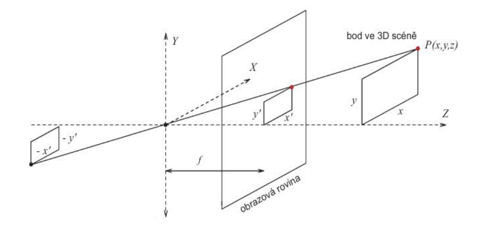
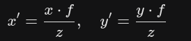
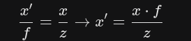
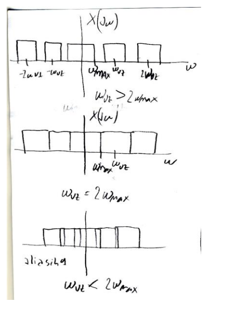
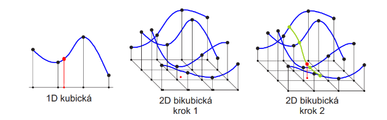
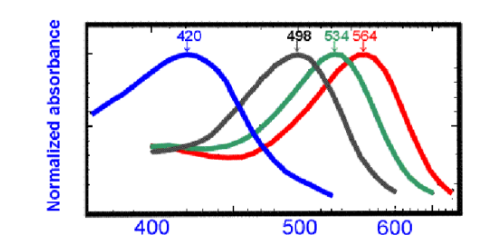
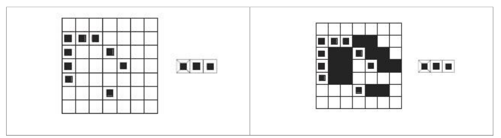
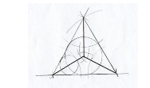
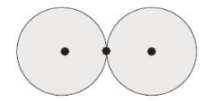

⚠️✅

# 1. Jaké jsou rozdíly mezi analýzou obrazu (počítačovým viděním) na jedné straně a počítačovou grafikou na druhé straně? Uveďte dva příklady, které rozdíly demonstrují.✅
Počítačové vidění se snaží napodobit lidské vidění snímáním obrazu elektronickými prostředky a
porozuměním jejich obsahu počítačovým zpracováním(interpretací).U počítačového vidění je snaha
porozumět libovolné 3D scéně. Počítačové vidění je považováno za součást kybernetiky. Kromě
vlastních vjemů hraje důležitou úlohu také zkušenost.
Např: Počítačové čtení automobilových značek. Vstupem je obraz výstupem je text.
Počítačová grafika se naopak snaží zobrazit člověku informaci z počítače, často s možností
interakce.Snaží se zobrazit libovolnou 3D scénu. Počítačová grafika je samostatná kategorie
grafiky.
Např: počítačová hra – na základě interakce zobrazí určitou scénu(seskládanou jen z jednoduchých
elementů)

# 2. Vysvětlete, co se v analýze obrazů rozumí interpretací. Použijte vyjádření pomocí matematického formalismu. Co je v této souvislosti objekt a k čemu pomáhá jeho zavedení? Co interpretace při analýze obrazů na jednu stranu přináší a čím použití metod omezuje?✅
Interpretaci v analýze obrazu formálně definujeme jako zobrazení, které převádí pozorovaná obrazová data (syntaxi) na model teorie (sémantiku). Objekt je v této souvislosti chápan jako reálná entita, kterou data reprezentují, což pomáhá ukotvit abstraktní teorii v konkrétním světě, ve kterém tato teorie platí. Hlavním přínosem interpretace je, že surovým datům dodává význam a umožňuje porozumění scéně na základě znalostí o světě. Nevýhodou je, že tento přístup omezuje univerzálnost metody, protože interpretace je vždy závislá na kontextu konkrétního světa a jedné teorii může odpovídat více různých světů.

# 3. Proč je porozumění obecným (trojrozměrným) scénám v počítačovém vidění těžké? Uveďte několik důvodů se stručným komentářem. (V přednášce bylo uváděno šest důvodů)✅
3D → 2D přináší ztrátu informace díky vlastnostem perspektivní transformace (matematická abstrakce, dírková komora).

Měřený jas je dán složitým fyzikálním postupem vytváření obrazu. Zář (angl. radiance) (≈ jas) závisí na typu světelných zdrojů, jejich poloze, intenzitě, poloze pozorovatele, lokální geometrii povrchu a odrazivosti povrchu. Obrácená úloha je špatně podmíněna.

Nevyhnutelná přítomnost šumu v každém měření ve skutečném světě.

Příliš mnoho dat Stránka A4, 300 dpi, 8 bit per pixel = 8.5 Mbytes. 
Neprokládané video 512 × 768, RGB (24 bit) = 225 Mbits/sekundu.

Nutnost zahrnout interpretaci
Lokální okno v kontrastu s potřebou globálního pohledu

# 4. Lokální a globální zpracování. • Diskutujte stručně rozdíl mezi lokálním a globálním přístupem v analýze obrazu. Uveďte vý-hody a nevýhody obojího. • Uveďte se stručným komentářem dva příklady lokálních operací. • Uveďte se stručným komentářem dva příklady globálních operací.✅
## Lokální:
Lokálně nejsme schopni vnímat kontext obrazové informace. ten je velmi důležitý. může dojit ke špatné interpretaci. Nutnost zahrnout interpretaci

**Výhody**: Citlivost k lokálním detailům, schopnost zachytit texturu a detaily na mikroskopické úrovni.

**Nevýhody**: Může být citlivý na šum nebo místní variace a může vyžadovat komplexnější
zpracování. 

**např.** lokální průměrování, detekce hran

## Globální:
**Výhody**: Jednoduchý výpočet, vhodný pro celkové zpracování obrazu, nemá problémy s lokálním šumem nebo variacemi.

**Nevýhody**: Může ztratit detaily a informace na mikroskopické úrovni. 

**např.** úprava jasu, inverze obrazu

# 5. Vysvětlete pojem spojitá obrazová funkce f (x, y) nebo f (x, y, t). Vysvětlete, co jsou parametry x, y, t. Uveďte několik příkladů reálných obrazových funkcí sejmutých s pomocí různých fyzikálních principů. Hodnota funkce f tedy bude odpovídat různým fyzikálním veličinám.✅
Obrazová funkce je matematický popis rozložení energie v rovině (dvourozměrný signál), kde parametry x, y představují prostorové souřadnice. Hodnoty obrazové funkce f odpovídají některé fyzikální veličině, např. jasu u obrazu z černobílé TV kamery, teplotě u termovizní kamery nebo hustotě tkáně u rentgenu. Statický obraz je popsán funkcí dvou souřadnic f(x,y). Obrazová funkce tří proměnných se použije, když se plošné obrazy mění v čase t, tj. f(x,y,t), nebo v případě objemových obrazů f(x,y,z) – např. tomograf.

# 6. Co je to kvantování obrazu? Jak a v jakém zařízení se kvantování realizuje? Kolik kvantizačních úrovní zhruba rozliší u monochromatického obrazu člověk? Co je v obraze patrné, když je kvantizačních úrovní méně, než by mělo být?✅
Kvantování je přiřazení určité diskrétní hodnoty jasu danému bodu. Realizuje se na A/D
převodníku. Člověk rozliší zhruba 50 úrovní jasu. Když je v obraze méně kvantizačních úrovní než
je potřeba zaniknu jemné detaily obrazu a vzniknou falešné obrysy.

# 7. Uvažujte digitalizaci dvojrozměrného obrazu. Zde se stejně jako při digitalizaci jednorozměrného signálu stanovuje vzdálenost ekvidistantních vzorků podle Shannonovy věty o vzorkování. Pro dvojrozměrné obrazy je potřebné navíc ke stanovení vzdálenosti mezi vzorky (což se řeší podobně jako u jednorozměrného signálu) vyřešit další záležitost. Jakou? Jak se záležitost typicky řeší a jaké výhody či nevýhody tato řešení mají? Poznamenávám, že se neptám na kvantování.✅
Je potřeba rozhodnout o geometrickém uspořádání vzorků (topologii mřížky). Existují pouze 3 pravidelné mnohoúhelníky, jimiž lze beze zbytku pokrýt rovinu: trojúhelníky, čtverce a šestiúhelníky.

**Čtvercová mřížka (nejčastější)**:
- Výhody: Snadno realizovatelná (odpovídá maticovému zápisu, polím v paměti), standard pro většinu HW (CCD/CMOS, monitory).
- Nevýhody: Měření vzdálenosti (anizotropie): Vzdálenost mezi středy sousedních pixelů není konstantní (vzdálenost po úhlopříčce je 2​-krát větší než po straně).

**Hexagonální mřížka (včelí plástve)**:
- Výhody: Izotropie – všech 6 sousedů je stejně daleko. Má jednoznačnou definici spojitosti (neřeší se 4 vs 8 okolí). Je efektivnější při vzorkování kruhově symetrických signálů (menší hustota vzorků pro stejnou informaci).

- Nevýhody: Chybí přímá podpora v HW, složitější adresování pixelů a implementace algoritmů (např. FFT je na čtvercích mnohem rychlejší díky separabilitě).

# 8. Jaké výhody přináší použití hexagonální mřížky (podobné včelí plástvi) při vzorkování obrazu? Proč se taková mřížka nepoužívá ve většině digitalizačních karet?✅
**Výhody**: Má stejné vzdálenosti pro všechny sousedy jednotlivého bodu v mřížce, větší obrazová stabilita

**Nevýhody**: Většina technologií a obrazových standardů používá čtvercový rastr, vyžaduje složitější hardware, nekompatibilita pro běžné operace např. Fourierovu frekvenční filtraci.

# 9. Relace souvislosti mezi dvěma pixely binárního digitálního obrazu (tj. existuje mezi nimi cesta) definuje rozklad obrazu (tj. množiny) na třídy ekvivalence (tj. oblasti). Jaké tři vlastnosti musí relace splňovat, aby byla ekvivalencí. Ověřte platnost těchto tří vlastností pro relaci souvislosti.✅
## 1. Reflexivita:
- Každý pixel je sám se sebou v souvislosti (existuje cesta od pixelu do sebe sama).
- Reflexivita je obvykle automaticky splněna.

## 2. Symetrie:
- Pokud pixel A je ve vztahu souvislosti s pixelem B, pak i pixel B musí být ve vztahu souvislosti s pixelem A.

## 3. Tranzitivita:
- Pokud jsou pixely A a B ve vztahu souvislosti a pixely B a C jsou ve vztah souvislosti, pak musí být také pixely A a C ve vztahu souvislosti.
- Tranzitivita je klíčová pro vytváření tříd ekvivalence, protože umožňuje spojování sousedících pixelů do stejné třídy na základě spojitosti.

# 10. (a) Definujte (i) oblast a (ii) konvexní oblast ve dvojrozměrném obraze. Nakreslete příklad konvexní a nekonvexní oblasti. (b) Definujte konvexní obal. (c) Pro nekonvexní oblast z bodu (a) zakreslete konvexní obal.✅
**Konvexní** Když vezmeš jakékoliv dva body uvnitř tvaru a spojíš je rovnou čarou (úsečkou), ta čára zůstane celá uvnitř.

**Nekonvexní** Existují dva body uvnitř, které když spojíš, tak ta čára vyleze ven do prázdna. (Třeba u písmene "U" když spojíš oba vrchní konce).

**Konvexní obal** Představ si nekonvexní tvar (třeba hvězdu). Konvexní obal je ten nejmenší možný konvexní tvar, do kterého tu hvězdu můžeš zabalit.
- Jednoduše: Je to tvar, který vznikne, když vyplníš všechny "zálivy" a "promáčkliny".

# 11. Vysvětlete v souvislosti s obrazy význam pojmů (a) prostorové rozlišení; (b) spektrální rozlišení; (c) radiometrické rozlišení a (d) časové rozlišení.✅
- **Prostorové rozlišení**: Týká se schopnosti senzoru rozlišovat mezi blízkými objekty nebo detaily v prostoru (je dáno velikostí pixelu / vzorkovací frekvencí). Vyšší prostorové rozlišení znamená, že senzor zobrazí i menší detaily ostře.

- **Spektrální rozlišení**: Je dáno počtem a šířkou spektrálních pásem (kanálů). Černobílá kamera: 1 široké pásmo (nízké rozlišení). Barevná kamera: 3 pásma (R, G, B).

- **Radiometrické rozlišení**: Souvisí s počtem diskrétních úrovní jasu (tzv. bitová hloubka), které senzor dokáže rozlišit. Vyšší radiometrické rozlišení znamená, že senzor zachytí více jemných odstínů mezi nejtmavší a nejsvětlejší částí obrazu (např. 8 bitů = 256 úrovní).

- **Časové rozlišení**: Týká se frekvence, s jakou systém dokáže opakovaně snímat stejnou scénu (snímková frekvence u videa nebo perioda návratu u družic). Vyšší časové rozlišení umožňuje zachytit rychlé změny v čase a sledovat dynamické jevy.

# 12. Napište definiční vzorec Shannonovy (též informační) entropie. Vysvětlete veličiny ve vzorci. K čemu se Shannonova entropie používá? Uvažujte šedotónový obraz. Uveďte alespoň dvě použití Shannonovy entropie v digitálním zpracování obrazu.✅
𝐻𝑒 = − ∑ 𝑃(𝐾) log2 𝑃(𝐾)𝑘 [bit]

**Používá se při kompresi obrazu**:
- Entropie tvoří limit při bezeztrátové kompresi dat. Data nelze více zhustit než dovoluje jejich entropie, pokud nechceme ztratit informace v datech.

**Segmentace obrazu**:
- V oblasti zpracování obrazu lze Shannonovu entropii použít pro segmentaci obrazu. Nízká entropie může signalizovat homogenní oblasti nebo struktury, což může být využito při identifikaci a oddělení různých objektů nebo regionů v obraze. Vyšší entropie může naznačovat složitější nebo nejistější oblasti v obraze

# 13. I když nic nevíme o interpretaci obrazových dat, můžeme měřit informační obsah obrazu Shannonovou entropií. Uvažujte šedotónový obraz. Ukažte, jak spočítat entropii jasových úrovní obrazy s 2b stupni šedi obrazu o rozměru N × N z histogramu h(i), i = 0, . . . , 2b − 1. Pro jaký histogram bude entropie největší?✅
Počty jednotlivých jasů v histogramu podělíme rozměrem NxN a z vypočtených odhadů pravděpodobností vypočteme odhad entropie.

Entropie bude největší pro rovnoměrné rozložení jasů v histogramu.

# 14. Napište definiční vztah pro Shannovovu entropii. Uvažujte šedotónový obrázek. Spočítejte entropii na základě histogramu jasu hi , i = 0, . . . , 255. Ví se, že předzpracováním obrazu se entropie nezvětší. Co musíme udělat, když přesto potřebujeme obraz s větší entropií?✅
𝐻𝑒 = − ∑ 𝑃(𝐾) log2 𝑃(𝐾)𝑘 [bit]

## Možnosti zvýšení entropie:
**Přidat šum (Noise/Dithering)**: Přičtení náhodného šumu k obrazu zvýší míru "nepořádku" (neurčitosti) v datech, a tím matematicky zvýší entropii.

**Ekvalizace histogramu (Histogram Equalization)**: Toto je specifická výjimka často očekávaná u zkoušky. Cílem této metody je přiblížit histogram rovnoměrnému rozdělení. Rovnoměrné rozdělení má teoreticky maximální možnou entropii. Ačkoliv u diskrétního obrazu nemůžeme informaci "vyrobit", ekvalizace se snaží dostupnou bitovou hloubku využít co nejefektivněji (maximalizovat entropii výstupního obrazu).

# 15. Při pořizování obrazu trojrozměrného (3D) světa kamerou se geometrie zobrazení reprezentuje modelem dírkové kamery (tj. perspektivní projekcí), ve kterém se 3D bod (x, y, z) promítne do obrazové roviny jako (x, y). Nakreslete odpovídající obrázek (stačí o dimenzi menší, tj. plošný). Předpokládejte, že znáte 3D souřadnice (x, y, z), ohniskovou vzdálenost f, tj. vzdálenost obrazové roviny od středu promítání. Odvoďte vztah pro x.✅

Díky podobným trojúhelníkům pro perspektivní zobrazení platí:

Odvození přes podobné trojúhelníky:

# 16. K čemu slouží optická soustava (především objektiv) u fotoaparátu. Popište roli objektivu neformálně z fyzikálního hlediska.✅
Úkolem objektivu je posbírat rozbíhavé paprsky světla odražené od bodů ve scéně a "zlomit" je tak, aby se znovu sbíhaly (zaostřily) do jednoho bodu na rovině snímače. Tím vytváří věrný obraz scény.

**Zobrazení a zaostřování**
- Objektiv promítá 3D scénu do 2D roviny. Posunem čoček mění rovinu ostrosti tak, aby se paprsky protly přesně na povrchu snímače (nikoliv před ním nebo za ním).

**Sběr světla (Světelnost)**
- Objektiv soustřeďuje (sbírá) světlo z větší plochy na malou plochu snímače. Tím výrazně zvyšuje jas obrazu oproti pouhé dírkové komoře.

**Kontrola expozice (Clona)**
- Clona (umístěná uvnitř objektivu) mechanicky reguluje průměr otvoru, kudy proudí světlo. Tím ovlivňuje expozici a zároveň hloubku ostrosti (kolik toho je ostré před a za zaostřeným bodem).

# 17. Fungování objektivu fotoaparátu se obvykle na praktické úrovni vysvětluje teorií geometrické optiky. Za jakých předpokladů se může být zjednodušený model geometrické optiky použit? Podotýkám, že složitější fyzikální model je model vlnové optiky.✅

Geometrickou optiku (malování čar podle pravítka) můžeme použít tehdy, když ignorujeme vlnovou povahu světla, čočky jsou dostatečně velké a paprsky jdou blízko středu objektivu.

## Kdyby to nestačilo
**Rozměry systému vs. vlnová délka**:
- Základní předpoklad: Vlnová délka světla (λ) je zanedbatelně malá ve srovnání s rozměry optických prvků (čočky, clony) a objektů. Limitně se blíží nule (λ→0).

**Malé úhlové rozměry (Paraxiální aproximace)**:
- Pro použití jednoduchých zobrazovacích rovnic (jako je čočková rovnice) se předpokládá, že paprsky svírají s optickou osou jen malé úhly. Pokud jsou úhly velké, vznikají optické vady (aberace), které jednoduchý model nezohledňuje.

**Homogenita prostředí**:
- Předpokládá se, že prostředí je izotropní a homogenní (nemění se index lomu), takže se světlo šíří po přímkách. K lomu dochází jen na rozhraní prostředí (čočka-vzduch).

**Zanedbání difrakce (ohybu)**:
- Předpokládá se, že nedochází k ohybu světla. Tento předpoklad platí pouze tehdy, pokud jsou rozměry otvoru (clony) MNOHONÁSOBNĚ VĚTŠÍ než vlnová délka světla.

# 18. Srovnejte na konceptuální úrovni z pohledu fotografování vlastnosti dírkové komory a objektivu složeného z čoček.✅
**Dírková komora**: Má teoreticky nekonečnou hloubku ostrosti (nemusí se ostřit), ale extrémně nízkou světelnost. Dírka sbírá jen málo fotonů, proto vyžaduje dlouhé expozice.

**Objektiv (Čočka)**: Sbírá násobně více fotonů (světla) z celé plochy čočky a soustředí je do jednoho bodu, což umožňuje krátké expozice a ostrý obraz. Na rozdíl od dírky musí být zaostřen na konkrétní vzdálenost(má omezenou hloubku ostrosti) – objekty mimo tuto vzdálenost budou neostré.

# 19. Vysvětlete, co je přirozená vinětace. Projevuje se přirozená vinětace více u normálních objektivů nebo u širokoúhlých objektivů? Zdůvodněte (v lepším případě odvoďte), proč k přirozené vinětaci dochází.✅
Je to jev, kdy dochází k poklesu jasu (intenzity osvětlení) směrem k okrajům obrazu. Více se projevuje u širokoúhlých objektivů, protože pracují s většími úhly dopadu světla.

# 20. Vysvětlete, co je to radiální zkreslení objektivu. Jak se v sejmutém obraze projevuje a jak se opravuje?✅
Jde o převládající geometrickou vadu, kdy se měřítko zobrazení mění se vzdáleností od středu obrazu. Rovné linie se v obraze jeví jako zakřivené.

Projevuje se ve dvou hlavních formách:
- Soudkovité (Barrel): Linie se vyboulují směrem ven (typické pro širokoúhlé objektivy/krátká ohniska).
- Poduškovité (Pincushion): Linie se prohýbají směrem dovnitř (typické pro teleobjektivy).

Koriguje se výpočtem (přemapováním pixelů) na základě známých koeficientů zkreslení, které se zjistí kalibrací kamery.

# 21. Vysvětlete pojem pojem Bayerova mřížka u barevných kamer a fotoaparátů? Liší se rozlišení v barvě (na čipu) od počtu pixelů? Pokud ano, jak?✅
Bayerova mřížka je mozaika barevných filtrů umístěná přímo na obrazovém snímači. Umožňuje snímači (který jinak měří jen intenzitu světla) zachytit barevný obraz. Mřížka má podobu vzoru, ve kterém jsou jednotlivé pixely pokryty filtry propouštějícími jen jednu barvu. Tento vzor (RGGB) se skládá z 50 % zelených (G), 25 % červených (R) a 25 % modrých (B) pixelů. Zelené je více, protože lidské oko je na tuto barvu nejcitlivější.

Rozlišení v barvě se liší od počtu pixelů (je nižší). Protože každý pixel fyzicky změří jen jednu barevnou složku (R, G nebo B), zbývající dvě barvy pro daný bod se musí dopočítat (interpolovat) z hodnot okolních pixelů (tzv. demosaicing). Plná barevná informace tedy není změřená v každém bodě, ale je zčásti odhadnutá.

# 22. Vysvětlete pojem hloubka zaostření u optického objektivu. Jaký (obvykle ovladatelný) parametr objektivu umožňuje měnit hloubku zaostření?✅
**Hloubka zaostření (Depth of Focus)**: Týká se obrazového prostoru (uvnitř kamery). Je to tolerance polohy snímače – rozsah, v jakém můžeme posunout snímač podél optické osy, aniž by se obraz stal rozmazaným (rozptylový kroužek nepřesáhne velikost pixelu).

Ovladatelný parametr je clona (clonové číslo). Zvýšení clonového čísla (zmenšení otvoru) zúží kužel světelných paprsků. Tím se zmenší průměr rozptylových kroužků neostrých bodů a zvětší se jak hloubka ostrosti, tak hloubka zaostření.

# 23. Představte si, že snímáme 3D scénu, jejíž elementární ploška odráží jistou záři L do CCD kamery. To se na jejím světlocitlivém čipu odpovídá ozáření E, které je přímo úměrné hodnotě obrazové funkce f (x, y), tj. jasu (přesněji záři). Na jakých vlastnostech elementární plošky a zdrojů světelné energie hodnota f (x, y) pro pevně zvolená x, y závisí?✅
- lokální geometrie
- koeficient odrazivosti albedo
- úhel natočení
- směr pohledu
- vlnová délka dopadajícího světla

# 24. Jaké odrazivostní vlastnosti má lambertovský povrch? K čemu se zjednodušení odrazivostních vlastností daných lambertovským modelem používá? Uveďte alespoň dva příklady použití.✅
je idealizovaný model povrchu, který má několik zjednodušujících předpokladů o odrazivosti.
• Odráží světelnou energii rovnoměrně do všech směrů. Proto je zář (a také jas) ze všech
směrů konstantní. Jeho BRDF je také konstantní.
• Odrazivost je nezávislá na úhlu pohledu
Lambertovský model je pro svou jednoduchost značně oblíbený. Používá se pro výpočty
odrazivosti nebo v počítačové grafice. 3D rekonstrukce fotky pokud je tenhle pixel tmavší víme že je dál od světla

# 25. Co řeší v radiometrii rovnice ozáření? Zkuste úlohu formulovat (asi Vám pomůže, když si nakreslíte obrázek a označíte v něm veličiny) a naznačit myšlenky odvození (vzorce nejsou nezbytně nutné).✅
Rovnice ozáření popisuje základní vztah mezi tím, jak moc září objekt ve skutečnosti (Zář L), a tím, kolik světla nakonec skutečně dopadne na snímač kamery (Ozáření E). Jednoduše řečeno: je to matematický předpis, který nám říká, jak objektiv převede jas scény na jas fotky.

Myšlenka odvození stojí na logickém sledování toku světla: Vycházíme z malé plošky na scéně, která vyzařuje světlo do prostoru. Objektiv kamery z tohoto záření „vykrojí“ jen určitou část – konkrétně kužel světla, který se vejde do otvoru clony (průměr d). Tato zachycená energie se pak přenese a soustředí na odpovídající malou plošku na snímači (pixel).

## Když nebude stačit
Rovnice ozáření (Fundamental Radiometric Equation) popisuje vztah mezi září (Radiance L) povrchu scény a ozářením (Irradiance E), které dopadá na snímač kamery. Říká, že obraz je přímo úměrný jasu scény, ale je ovlivněn nastavením kamery a polohou v obraze.
E=L⋅4π​(fd​)2cos4α

Kde:

    E: Ozáření obrazu [W⋅m−2] (energie dopadající na pixel).

    L: Zář scény [W⋅m−2⋅sr−1] (jas objektu).

    d: Průměr otvoru clony (aperture).

    f: Ohnisková vzdálenost (vzdálenost snímače od čočky).

    α: Úhel paprsku od optické osy (způsobuje přirozenou vinětaci).

Myšlenky odvození (kroky):

    Zdroj: Uvažujeme elementární plošku objektu dO, která vyzařuje energii (má zář L).

    Sběr světla: Spočítáme, kolik energie (tok Φ) dopadne z této plošky na čočku o průměru d. To závisí na prostorovém úhlu, pod kterým ploška "vidí" čočku.

    Přenos: Předpokládáme bezeztrátovou čočku – veškerá energie zachycená čočkou je soustředěna do plošky obrazu dI.

    Geometrie: Z podobnosti trojúhelníků (perspektivní zobrazení) vyjádříme poměr velikosti ploch dO a dI.

    Závěr: Dosazením zjistíme, že dopadající energie na jednotku plochy snímače (E) klesá s druhou mocninou clonového čísla (f/d) a se čtvrtou mocninou úhlu (cos4α).

Popis k obrázku: Optická osa je osa Z, objektiv (čočka) je v počátku.

    dO: Ploška na objektu (zdroj).

    dI: Ploška na snímači (obraz).

    d: Průměr čočky.

    α: Úhel mezi optickou osou a paprskem (určuje polohu pixelu na snímači).

    z: Vzdálenost objektu od čočky.

# 26. Charakterizujte předzpracování obrazu. Co je vstupem a výstupem předzpracování obrazu. K čemu předzpracování obrazu slouží? Uveďte tři příklady použití metod předzpracování.✅
Předzpracování obrazu (tzv. low-level processing) je fáze zpracování, která připravuje data pro následnou automatickou analýzu. Klíčovou charakteristikou je, že vstupem je obraz a výstupem je opět obraz (nikoliv text, graf nebo příznaky).

**Slouží ke dvěma hlavním účelům:**
- Potlačení nežádoucích vlivů vzniklých při snímání (šum, geometrické zkreslení, neostrost).
- Zvýraznění důležitých vlastností pro další zpracování (např. vytažení hran).

**Příklady metod:**
- Filtrace (odstranění) šumu – např. vyhlazování nebo mediánový filtr.
- Úprava jasu a kontrastu – např. ekvalizace histogramu pro lepší využití dynamického rozsahu.
- Zaostření

# 28. Charakterizujte dvojrozměrnou konvoluci. K čemu se dvojrozměrná konvoluce používá v digitálním zpracováním obrazu?✅
Dvourozměrná konvoluce je matematická operace, která kombinuje obrazy s konvoluční maskou tak, aby vznikl
obraz třetí (násobení ve frekvenční oblasti). Používá se jako frekvenčně selektivní filtr přičemž lze
definovat: dolní propust (odstranění šumu, rozmazání) horní propust (zvýraznění hran v obrázku)

# 29. Jakými metodami předzpracování obrazu zvýšíte kontrast šedotónového obrazu pro pozorovatele, máte-li k dispozici právě tento jediný obraz. Uveďte alespoň dvě kvalitativně odlišné metody. Vysvětlete stručně princip těchto metod.
## Histogramová ekvalizace:✅
- Tato metoda se snaží rovnoměrně rozdělit jasové úrovně v histogramu obrazu. Histogram je transformován tak, aby byl co nejvíce uniformní. Tím se zvýší kontrast mezi různými jasovými úrovněmi.

## Adaptivní kontrastová úprava:
- Tato metoda bere v úvahu okolní regiony pixelů a upravuje kontrast lokálně na základě charakteristiky každého regionu. Místo jednotné transformace celého obrazu adaptivní kontrastová úprava analyzuje okolí každého pixelu a upravuje kontrast v souladu s okolními hodnotami.

# 30. Napište definiční vztah pro přímou a inverzní jednorozměrnou Fourierovu transformaci. Vyjádřete neformálně princip a význam Fourierovy transformace.✅

Fourierova transformace je vyjádření časově závislého signálu pomocí harmonických signálů, tj.
funkcí sin a cos, obecně tedy funkce komplexní exponenciály. Slouží pro převod signálů z časové
oblasti do oblasti frekvenční. Signál musí být periodický a splňovat Dirichletovy podmínky. Signál
může být buď ve spojitém či diskrétním čase.

# 31. Jaká je asymptotická výpočetní složitost jednorozměrné Fourierovy transformace.Použijte značení ‘velké O’ v závislosti na délce n vstupního diskrétního signálu (posloupnosti).✅
O(n2)

# 32. Vysvětlete, co je dvojrozměrná Fourierova transformace, její rozdíl od jednorozměrné (můžete definičním vzorcem nebo neformálně). Jak se dvojrozměrná Fourierova transformace používá ve zpracování obrazu.✅
Dvourozměrná Fourierova transformace je rozšířením jednorozměrné Fourierovy transformace na dvourozměrné oblasti, jako jsou například matice nebo obrazy. Zatímco jednorozměrná Fourierova transformace pracuje s jednorozměrnými signály, dvojrozměrná Fourierova transformace zpracovává dvourozměrné signály, což umožňuje analýzu prostorové struktury a frekvenčního obsahu dvourozměrných dat.

Používá se zejména k filtraci a zpracování obrazu, kompresi dat nebo analýze obrazových textur.

# 33. Vztah mezi šířkou frekvenčního spektra ve Fourierově transformaci a dobou trvání jednorozměrného signálu je dán (Heisenbergovým) principem nejistoty. Formulujte neformálně princip a vysvětlete jeho význam pro frekvenční analýzu ve zpracování signálů (obrazů).✅
Čím přesněji změřím čas, tím rozmazanější bude informace o frekvenci a naopak

# 34. Fourierova transformace je definována pro periodické signály. Mnohé praktické signály, s nimiž běžně pracujeme, jsou neperiodické. Nazvěte a neformálně vysvětlete dva přístupy, které se zde obvykle používají.✅
**Okenková metoda**: zpracovat signál po malých částech (oknech) a předpokládat, že vně je signál periodický.

**Použití složitějších bázových funkcí**, např. vlnek ve vlnkové (wavelets) transformaci

# 35. Vyjádřete větu o konvoluci, tj. jak je konvoluce vyjádřena ve Fourierově transformaci. Pro jednoduchost uvažujte jednorozměrný případ.✅
f(t)∗g(t) ⟷ F(ω)⋅G(ω)

Věta o konvoluci (Convolution Theorem): Konvoluce dvou funkcí v časové (nebo prostorové) oblasti odpovídá prostému násobení jejich spekter ve frekvenční oblasti (a naopak).

# 36. Jaká je výpočetní složitost diskrétní Fourierovy transformace pro dvojrozměrný obraz o velikosti N × N pokud byste v algoritmu použili přímo definiční vztah? Připomínám, že asymptotický odhad algoritmické složitosti se zapisuje formou O(.), kde se v argumentu v našem případě bude vyskytovat výraz obsahující N . Na multiplikativní a aditivní konstanty se nebude brát zřetel.✅
O(n4)

# 37. K urychlení diskrétní Fourierovy transformace byl před více než padesáti lety navržen algoritmus rychlé Fourierovy transformace (FFT). Jaký je jeho princip? Jsou nějaká omezení na velikost vstupního 2D obrazu?✅
Principem je metoda rozděl a panuj. Dlouhý signál se opakovaně půlí na sudé a liché vzorky, dokud nezbydou jen triviální dvojice. Ty se snadno spočítají a pomocí „motýlkového schématu“ poskládají zpět.

Omezení je Mocniny 2 aby se to dalo vždycky rozdělit

# 38. Jaká je algoritmická složitost algoritmu FFT pro dvojrozměrný obraz o velikosti N × N ?✅
O(n2) * log N

# 39. Formulujte Shannonovu (též Nyquistovu, Kotelnikovu) větu o vzorkování pro jednodušší případ jednorozměrného signálu. Vysvětlete (stačí neformálně, obrázek pomůže), jak se věta o vzorkování dokazuje (nápověda: frekvenční spektra).✅
Formulace: Abychom mohli signál z digitálních vzorků bezchybně vrátit zpět do analogové podoby, musí být vzorkovací frekvence větší než dvojnásobek nejvyšší frekvence v signálu.

# 40. (a) Televizní signál o 25 snímcích za sekundu je vzorkován do matice 500 × 500 pixelů ve 256 jasových úrovních. Vypočtěte nejmenší vzorkovací frekvenci (v kHz), kterou musí být signál v digitizéru (angl. frame grabber) vzorkován? (b) Jak se jmenuje věta, podle které jste výpočet realizovali? Naznačte myšlenku jejího odvození (stačí úvaha, vzorce nejsou nezbytně nutné).✅
a) Vypočtěte nejmenší vzorkovací frekvenci (v kHz). • 6 250 kHz (Výpočet: 500 pixelů × 500 pixelů × 25 Hz = 6 250 000 Hz = 6 250 kHz. Počet jasových úrovní nemá na vzorkovací frekvenci vliv, jen na datový tok).

b) Jak se jmenuje věta a naznačte myšlenku odvození. 
- Shannon-Kotělnikovův teorém (nebo Nyquist-Shannonova věta). 
- Tento teorém se dokazuje přes frekvenční spektra. Z Fourierovy transformace vyplývá, že vzorkování v čase způsobí, že se spektrum signálu periodicky opakuje na násobcích vzorkovací frekvence fvz​. Aby se tato kopie spekter vzájemně nepřekrývala (nenastal aliasing), musí být vzorkovací frekvence minimálně 2krát vyšší než nejvyšší frekvence obsažená v signálu (fmax​).

# 41. Na obrázku je vlevo uveden vstupní intenzitní obraz a vpravo jeho Fourierovo frekvenční spektrum vyjádřeno jako intenzitní obraz - tmavé pixely odpovídají vysokým spektrálním hodnotám. Ve spektru jsou patrné dva tmavé kříže. První výraznější se kryje se svislým a vodorovným směrem. Druhý méně výrazný kříž je proti výraznému kříži mírně pootočen proti směru hodinových ručiček. Vysvětlete, jakým jevům v intenzitním obrázku kříže odpovídají.✅

**První výrazný kříž** - předpokládá že se obraz neustále dokola opakuje takže jenže levý okraj nenavazuje na pravý okraj

**Druhý kříž** Odpovídá římsám a věžím katedrály

# 42. Lineární ortogonální integrální transformace s výhodou používají pro reprezentaci signálů a obrazů (např. Fourierova, kosínová, metoda hlavních směrů) a pro jejich zpracování. Vysvětlete jaký je princip těchto metod. Zmiňte dva příklady použití.✅
**Princip**: Metoda vezme složitý signál (obraz) a rozloží ho na součet jednoduchých, na sobě nezávislých (ortogonálních) vln.

**Výhoda**: V tomto rozloženém stavu se mnohem lépe pozná, co je důležitá informace (tvar objektu) a co je zbytečnost (šum, neviditelné detaily).

**např**. komprese obrazu, filtrace

# 43. Roztřiďte metody předzpracování obrazu do čtyř skupin podle velikosti zpracovávaného okolí právě zpracovávaného pixelu. U každé skupiny uveďte alespoň jeden příklad.✅

| Skupina (Metoda) | Velikost okolí | Příklad operace |
| --- | --- | --- |
| **1. Bodové operace** |  pixel (žádné okolí) | Změna jasu, kontrastu, prahování, gamma korekce. |
| **2. Lokální operace** | Malé okolí (např. ) | Vyhlazování, ostření (konvoluce), detekce hran, medián. |
| **3. Globální operace** | Celý obraz | Fourierova transformace, ekvalizace histogramu. |
| **4. Geometrické transformace** | Teoreticky bod, prakticky okolí* | Rotace, změna měřítka, zkosení. |

# 44. Vysvětlete princip jasových korekcí (obvykle se používají k odstranění systematických vad při snímání obrazu), když se uvažuje multiplikativní model poruchy. Vyjádřete matematicky.✅
**Princip**: Cílem je odstranit systematické vady, jako je vinětace (ztmavnutí v rozích) nebo nerovnoměrná citlivost senzoru (špína na čipu, variabilita pixelů). Protože tyto vady mění jas násobením (např. v rohu je citlivost jen 80 %), musíme je opravit dělením.

# 45. Pro vyjádření afinních geometrických transformací obrazu se s výhodou využívají homogenní souřadnice. Vysvětlete, co jsou homogenní souřadnice. Jakou výhodu pro vyjádření afinních geometrických transformací přinášejí. (nápověda: vzpomeňte si na jazyk pro popis stránky PostScript).✅
**Co to je**: Přidáme k souřadnicím jedničku ([x,y]→[x,y,1]).

**Proč**: Abychom mohli posunutí (translaci) zapsat jako násobení maticí.

**Výhoda**: Všechny operace (rotace, posun, škálování) jsou teď stejného typu (násobení). Můžeme je všechny "smíchat" (vynásobit) do jedné výsledné matice a tu pak použít naráz.

# 46. Popište myšlenku odvození, které poskytne trasformaci vedoucí k ekvalizovanému histogramu.✅
Myšlenka odvození v kostce:

**Cíl**: Chceme, aby ve výsledném obrázku byly všechny barvy zastoupeny stejně (chceme plochý histogram).

**Úvaha**:
- Představ si, že vezmeš konkrétní pixel, který má ve starém obraze nějakou jasovou hodnotu (třeba šedou 100).
- Zjistíš, že 25 % všech pixelů v obraze je tmavších nebo stejných jako tento pixel. (Je to tedy "25. percentil").
- Aby byl nový histogram rovnoměrný, musí tento pixel v novém obraze dostat hodnotu 25 % maximálního jasu (tedy čtvrtinu rozsahu černé a bílé).

**Závěr (Odvození)**:
- Když tohle uděláš pro každý pixel, zjistíš, že vlastně jen sčítáš počty pixelů od černé až po aktuální hodnotu.
- To sčítání se matematicky jmenuje KUMULATIVNÍ HISTOGRAM.

# 47. Vysvětlete myšlenku ekvalizace histogramu. K čemu se ekvalizace histogramu používá ve zpracování obrazu?✅

Myšlenka odvození v kostce:

**Cíl**: Chceme, aby ve výsledném obrázku byly všechny barvy zastoupeny stejně (chceme plochý histogram).

**Úvaha**:
- Představ si, že vezmeš konkrétní pixel, který má ve starém obraze nějakou jasovou hodnotu (třeba šedou 100).
- Zjistíš, že 25 % všech pixelů v obraze je tmavších nebo stejných jako tento pixel. (Je to tedy "25. percentil").
- Aby byl nový histogram rovnoměrný, musí tento pixel v novém obraze dostat hodnotu 25 % maximálního jasu (tedy čtvrtinu rozsahu černé a bílé).

**Závěr (Odvození)**:
- Když tohle uděláš pro každý pixel, zjistíš, že vlastně jen sčítáš počty pixelů od černé až po aktuální hodnotu.
- To sčítání se matematicky jmenuje KUMULATIVNÍ HISTOGRAM.

Ekvalizace histogramu může vést ke zřetelnějšímu znázornění struktur u rentgenových snímků kostí a ke zvýraznění detailů fotografií

# 48. Vysvětlete, proč ekvalizovaný histogram diskrétního obrazu není obvykle plochý? V ideálním případě bychom to očekávali.✅
**Hlavní důvod**: Diskrétní povaha dat (nemožnost štěpení hodnot). V ideálním spojitém případě by ekvalizace fungovala dokonale. V digitálním obraze ale pracujeme s diskrétními hodnotami (0–255).

**Problém**: Pokud má v původním obraze velké množství pixelů stejnou hodnotu jasu (např. hodně pixelů má jas 50 – vysoký sloupec v histogramu), algoritmus musí všechny tyto pixely přesunout na jednu novou hodnotu (např. na 120).

**Nemožnost rozdělení**: Algoritmus nemůže říct: "Polovinu pixelů s jasem 50 dám na 120 a druhou polovinu na 121", aby to vyhladil. Musí je přesunout jako blok.

**Výsledek**: Původní vysoké sloupce (peaky) v histogramu zůstanou vysoké, jen se posunou jinam, a mezi nimi vzniknou prázdné mezery (nulové hodnoty). Výsledný histogram je tedy "roztrhaný", nikoliv plochý.

# 49. Obecně formulovaná transformace jasové stupnice T nahradí vstupní jas p novým jasem q = T(p). Předpokládejme obvyklý 8 bitový šedotónový obraz. Bude počet jasových úrovní ve výstupním obraze vždy stejný, jako ve vstupním obraze? Vysvětlete a uveďte příklady.✅
Nemusí být, záleží na konkrétní transformaci, například když transformace zahrnuje:
**Oříznutí**:
- Pokud transformace zahrnuje oříznutí hodnot mimo určitý rozsah, může to vést k omezení počtu jasových úrovní. Například, pokud transformace nastaví všechny hodnoty pod určitým prahem na nulu nebo maximální hodnotu, dojde k redukci počtu úrovní.

**Kvantizace**:
- Pokud transformace provádí kvantizaci (zaokrouhlování) hodnot jasových úrovní, může to také vést k redukci počtu úrovní. Například, pokud jsou výsledné hodnoty zaokrouhlovány na několik diskretních hodnot, zmenší se počet možných jasových úrovní.

**Nelineární transformace**:
- Některé nelineární transformace mohou vést na kompresi jasových úrovní nebo naopak. Například, kvadratická funkce může stlačit široký rozsah jasových úrovní na užší rozmezí.

# 50. Uvažujte šedotónový obrázek. Ekvalizace histogramu se využívá pro zvýšení kontrastu lepším využitím jasové stupnice. Zvyšuje ekvalizace histogramu množství informace v obrazu, pokud bychom množství informace měřili Shannonovou entropií? Vysvětlete a uveďte příklady.✅
Teoretickým cílem ekvalizace je dosáhnout rovnoměrného rozložení pravděpodobnosti (plochý histogram), což je stav s maximální možnou entropií pro daný rozsah jasu.

Nicméně u diskrétního digitálního obrazu narážíme na limit. Protože nemůžeme štěpit pixely stejné hodnoty, histogram nikdy nebude dokonale plochý. Prostým přeuspořádáním hodnot (permutací) se entropie nezvyšuje, a vlivem kvantizace (slévání hladin) může ve skutečnosti dokonce mírně klesnout. Ale vizuálně se informace 'rozprostře' lépe pro lidské oko.

# 51. Nechť je geometrická transformace (zahrnující změnu měřítka, rotaci, posun a zkosení) v rovině popsána afinním vztahem
# x′ = a0 + a1x + a2y ,
# y′ = b0 + b1x + b2y . (1)
# (a) Kolik nejméně vlícovacích bodů potřebujete znát, chcete-li spočítat koeficienty afinní transformace (1). (b) V praxi se obvykle použije více vlícovacích bodů, což bude odpovídat přeurčené soustavě rovnic (1). Proč se používá nadbytečný počet vlícovacích bodů? (c) Jakou metodou se obvykle přeurčená soustava rovnic řeší?✅

## A) 
**Správná odpověď**: 3 body.

**Vysvětlení**: Afinní transformace má 6 neznámých koeficientů (a0​,a1​,a2​ a b0​,b1​,b2​). Každý vlicovací bod nám dá 2 rovnice (jednu pro souřadnici x′ a jednu pro y′).
6 neznámý​ch/2 rovnice na bod=3 body.

## B)
transformace pouze odhaduje na základě vlícovacích bodů => více bodů = větší přesnost
odstranění šumu

## C)
Použije se Metoda nejmenších čtverců (MNČ) – anglicky Least Squares Method. (Případně pomocí pseudoinverzní matice).
- Tato metoda najde takové koeficienty transformace, aby součet čtverců chyb (vzdáleností mezi požadovanými a skutečnými polohami bodů) byl minimální.

# 52. Při geometrických transformacích diskrétních obrazů je nutné aproximovat hodnotu obrazové funkce f(x, y). Proč? Uveďte alespoň dvě metody pro takovou aproximaci (nejlépe obrázkem, vzorcem . . . )✅
Transformované souřadnice leží mimo pevně daný rastr.

**Metoda nejbližšího souseda**:
- přiřadí bodu x,y hodnotu jasu nejbližšího bodu g v diskrétní mřížce.

**Lineární interpolace**:
- využije okolí čtyř bodů sousedících se zpracovávaným bodem(x,y) a předpokládá, že
obrazová funkce je lineární kombinací jasu těchto 4 bodů. Vliv každého ze čtyř bodů v
lineární kombinaci je úměrný jeho blízkosti ke zpracovávanému bodu.

# 53. Vysvětlete princip interpolace jasu po geometrické transformaci metodou nejbližšího souseda a lineární interpolací. Když nakreslíte obrázek, bude to pro Vás i mě snazší✅
**Metoda nejbližšího souseda**:
- přiřadí bodu x,y hodnotu jasu nejbližšího bodu g v diskrétní mřížce.

**Lineární interpolace**:
- využije okolí čtyř bodů sousedících se zpracovávaným bodem(x,y) a předpokládá, že
obrazová funkce je lineární kombinací jasu těchto 4 bodů. Vliv každého ze čtyř bodů v
lineární kombinaci je úměrný jeho blízkosti ke zpracovávanému bodu.

# 54. Vysvětlete princip bikubické interpolace jasu po geometrické transformaci. Kolik vzorků obrazové funkce budete potřebovat? Když nakreslíte obrázek, bude to pro Vás i mě snazší.✅

Potřebujeme 16 vzorků (4*4) bereme sousedy sousedů

V prvním kroku se interpoluje v jednom směru souřadnic čtyřmi 1D kubickými polynomy (čtyři
modré křivky). Ve druhém kroku se najdou čtyři body (zelené body) odpovídající poloze (x, y).
Tyto body se proloží jedním 1D kubickým polynomem a najde se hledaná hodnota (červený bod).

# 55. Uvažujte filtraci náhodného aditivního šumu v obraze. Odhad správné hodnoty se může počítat jako aritmetický průměr n zašuměných hodnot. Kolikrát se po filtraci zmenší hodnota šumu vyjádřená směrodatnou odchylkou σ? Vysvětlete, jaký je statistický princip poklesu šumu (nápověda: centrální limitní věta).✅

Pokles: Šum klesá s odmocninou z počtu snímků (√n​).

Princip: Náhodný šum má kladné i záporné odchylky. Sčítáním (průměrováním) se tyto odchylky navzájem vyruší, zatímco užitečný signál (obraz) zůstává stejný a sčítá se.

Věta: Centrální limitní věta zaručuje, že rozptyl (chyba) průměru je menší než rozptyl jednotlivých měření.

# 56. Lze filtrovat šum v obraze obyčejným průměrováním z např. 21 vzorků, aniž by byl obraz po filtraci rozmazaný? Pokud ano, jak?✅
Ano, lze.

Jak: Nesmíme průměrovat okolní pixely v jedné fotce, ale musíme průměrovat stejný pixel napříč více snímky (v čase).

Podmínka: Scéna i kamera musí být statické (nehybné).

# 57. Na obrázku je výřez obrazové funkce. Tučně je ohraničeno okolí, ve kterém se má vypočítat filtrovaná hodnota, tj. filtrační maska. Vypočtěte filtrované hodnoty (a) při vyhlazování obyčejným průměrováním a (b) mediánovou filtrací pro právě zpracovávaný pixel ležící ve středu filtrační masky✅
(a) vypočítám prostě průměr se všech pixelů a nahradím jím prostřední pixel (vyjde 4)
(b) vypočítám medián z okolí: 0 0 0 0 0 0 **1** 1 1 4 15 15 15

# 58. Uvažujte filtraci šumu v obraze realizovanou konvolucí s maskou rozměru 11 x 11, která aproximuje gaussovský filtr. Jedná se o lineární operaci? Zkuste své rozhodnutí matematicky zdůvodnit.✅

Ano, je to lineární operace. Je homogenní i aditivní.

# 59. Použití rekurzivních filtrů (IIR, nekonečná impulsní odezva) přináší pro 2D obrazy problémy, které se u 1D signálů nevyskytují. Proto se rekurzivní filtry pro obrazy téměř nepoužívají. Vysvětlete, co je příčinou problémů? (nápověda: kauzalita).✅
Pro obrazy neexistuje přirozený směr, jakým byl čas pro 1D signály. Není principiální důvod proč
by měl být některý směr preferován. Ve zpracování obrazů se dává přednost nekauzálním filtrům s
nulovým fázovým posunem, a to proto, aby se v obraze neposouvaly hrany anebo jiné body
významné pro další analýzu. Pro 1D filtry je vypracovaná teorie jasná pro vícerozměrné filtry tomu
tak není, protože zobecnění Z-transformace do více dimenzí není snadné. Působí to základní
problémy při návrhu rekurzivních filtrů a studiu jejich stability.

# 60. Popište, jak funguje algoritmus SIFT, jeho jednotlivé kroky a kde se využívá, např. při zpracování medicínských dat✅
SIFT je algoritmus počítačového vidění, který detekuje a matematicky popisuje specifické "klíčové body" v obraze tak, aby byly bezpečně rozpoznatelné i při změně měřítka, natočení nebo osvětlení.

Funguje na principu hledání extrémů v postupně rozmazávaných verzích obrazu a v medicíně se klíčově využívá pro automatické zarovnávání (registraci) snímků z různých vyšetření (např. CT a MRI) nebo ke skládání panoramatických snímků při endoskopii.

# 61. Vysvětlete základní principy algoritmu SURF. Porovnejte ho s algoritmem SIFT. Kdy je vhodné použít algoritmy SURF, SIFT nebo ORB v biomedicínských úlohách?
SURF (Speeded Up Robust Features) je optimalizovaná varianta SIFTu, která dosahuje podobných výsledků, ale výrazně rychleji díky využití tzv. "integrálních obrazů" a aproximaci derivací pomocí čtvercových filtrů (box filters).

Klíčové body detekuje pomocí čtvercových obrazů místo jemných křivek a to je pro počítač mnohem jednoduší na vypočtení

Zatímco SIFT a SURF počítají se složitými čísly (desetinná místa, úhly), ORB funguje binárně (nuly a jedničky). Porovnává jen: 'Je tenhle bod světlejší než ten vedle? Ano/Ne.'

# 62. Vysvětlete vztah pojmů hrana (v obraze), hranový bod (edgel) a hranice oblasti.
**Hrana**:
- Hrana v obraze představuje oblast, kde dochází k rapidní změně intenzity jasu mezi
sousedícími pixely. 
- lokální vlastnost

**Hranový bod**:
- Hranový bod je konkrétní bod na hraně v obraze.

**Hranice oblasti**:
- Na rozdíl od hrany, která se zaměřuje na změny intenzity, hranice oblasti jsou
vymezeny jako rozhraní mezi dvěma odlišnými částmi obrazu, které mohou mít
různé vlastnosti, například barevné nebo texturové charakteristiky.
- globální vlastnost
- odděluje objekt od pozadí

# 63. Co je a jak se matematicky popisuje hrana v obrazové funkci f(x, y)? Definiční vzorce pro hranu uveďte pro spojitý i digitalizovaný obraz.
Hrana v obraze se dá poznat podle vysokého gradientu který se spočítá derivací a v digitálním obraze se používá rozdíl pixelů 

# 64. Co je to hranový element (angl. edgel)? K čemu se v analýze obrazů hranový element používá?
Definice: Hranový element (edgel – zkratka z edge element) je základní "stavební kámen" hrany. Není to jen bod v obraze, ale je to vektor, který nese informaci o lokální změně jasu.

Použití v analýze: Samotný edgel nám o objektu nic neřekne (může to být šum). Používá se jako mezivýsledek pro vyšší úroveň zpracování:

# 65. Pro hledání hran v obrazové funkci f (x, y) se někdy používá Laplaceův operátor ∇2 f (x, y). Napište vzorec, kterým je definován pro spojitou obrazovou funkci f (x, y). Jsou vlastnosti Laplaceova operátoru směrově závislé?
Ne nejsou směrově závislé ve všech směrech stejný
∇2f=fxx​+fyy​

# 66. Jakou výhodu přináší určování polohy hrany jako průchodu druhé derivace obrazové funkce nulovou hladinou? Napište, v jakých hranových detektorech se této výhody využívá a jak.
Přesná lokalizace: Zatímco 1. derivace má v místě hrany "kopeček" (maximum), který může být široký a těžko se hledá jeho přesný střed, 2. derivace má v místě hrany průchod nulou (Zero Crossing). Najít místo, kde funkce mění znaménko (z plus do mínus), je výpočetně velmi snadné a přesné (na 1 pixel).

**Marr-Hildrethův detektor (LoG – Laplacian of Gaussian)**: Protože je druhá derivace náchylná na šum musíme ho první vyhladit potom se provede druhá derivace a pak hledání nulových průchodů

# 67. Marrův přístup k detekci hran využívá hledání průchodu druhé derivace obrazové funkce nulou. Při výpočtu derivace se s výhodou pro potlačení vlivu šumu používá konvoluce (rozmazání) gaussovským filtrem g. Druhá derivace takové operace nechť je označena ∇2d = ∇2 (f ∗ g) = ∇2f ∗ g = . . .. Metoda využívá vtipný trik (obejde derivaci obrazové funkce f). Prosím, abyste ho použili a pokračovali v předchozím odvození. Díky jakým vlastnostem použitých operací lze trik použít?
Místo abych rozmazával obrázek a pak ho složitě derivoval a pak ještě na nej dával filter jednoduše první zderivuji filtr a pak tenhle laplacian of gausian filter použiji na původní obrázek

# 68. Představte si, že máte k dispozici již sejmutý digitální obraz. Vysvětlete princip ostření obrazu (neptám se globální úpravu jasové stupnice podle histogramu). Co je cílem ostření? V jakých situacích se ostření používá?
Princip ostření založený na detekovaných hranách v obraze spočívá v tom, že na nalezených
hranách vstupního obrazu zvětšujeme ve výstupním obraze rozdíly jasu mezi obrazovými body
určenými velikostí konvoluční masky (ostření lze také interpretovat jako zdůraznění vysokých
frekvencí). Cílem ostření obrazu je upravit obraz tak, aby v něm byly strmější hrany. Používá se
když se má dosáhnout kontrastnějšího obrazu a to buď na displeji nebo při tisku. 

# 69. Vysvětlete pojem paletový barevný obrázek. K čemu a proč se barevné paletové obrázky používají?
Např GIF.
Barevná paleta nebo také indexovaná barevná paleta je používána pro zobrazení a archivaci obrázků
počítačové rastrové grafiky. Každé barevné položce v paletě je přiděleno číslo a každý pixel obrazu
uchovává číslo, která odkazuje na odpovídající položku palety. Hlavní výhodou použití palety pro
generování rastrového obrázku o malém počtu různých barev je relativně malá paměťová náročnost.
Nevýhodou je většinou nízké barevné rozlišení obrázku. Barva položky palety se obvykle volí z
větší množiny barev než je počet položek palety

# 70. Charakterizujte, co je barva. Souhrou jakých tří jevů vzniká u člověka barevný vjem
Barva charakterizuje vjem pozorovatele na základě (viditelného) záření původně přicházejícího ze
světelného zdroje (směs záření o různých vlnových délkách) a změněného díky vlastnostem
pozorovaných objektů.

- Barva souvisí s vlastnostmi světla (osvětlení scény).
- Barva souvisí s vlastnostmi pozorovaného objektu.
- Barva souvisí s mechanismy vnímání člověkem.

# 71. Proč vidíme některé objekty barevně? Uvažujte např. jednu čerstvě ustřiženou červenou růži. Vysvětlete, proč vidíme stonek zeleně a květ červeně.
Subjektivní vnímání barvy: Vnímání barvy člověkem přidává subjektivní vrstvu nad objektivní fyzikální pozorování, tj. vlnovou délku elektromagnetického záření. Barva tedy představuje psychofyzikální jev. Barvu vnímáme díky tomu, že některé materiály více a některé měně odrážejí/pohlcují dopadající světlo. Podle toho které vlnové délky více pohlcují/odrážejí takovou
mají pro nás barvu

# 72. Když charakterizujeme barvu z fyzikálního hlediska, představujeme si viditelnou část barevného spektra vlnových délek elektromagnetického záření získaného např. rozkladem bílého světla pomocí hranolu (pokus I. Newtona). Napište rozsah vlnových délek (od do) v nanometrech [nm], které lidské oko vidí. Uveďte čtyři barvy viditelného spektra uspořádané vzestupně podle jejich vlnových délek. (Nápověda: vzpomeňte si na barvy v duze).
Od 380-750nm
fialová, modrá, zelená, žlutá, červená

# 73. Jaké senzory jsou v lidském oku pro barevné vidění? Nakreslete zhruba citlivost jednotlivých senzorů grafem, kde na vodorovné ose bude vlnová délka kvantifikovaná v nanometrech [nm] a na svislé ose relativní citlivost v rozsahu od 0 do 1.
Používají se barevné čípky kde pro každou barvu je jeden druh. Pto monochromatické vidění se využívají tyčinky

# 74. Vysvětlete, co je barevný metamerismus. Jaký je jeho význam pro vnímání barev člověkem?
Metamerismus je jev, kdy lidské oko vnímá dvě fyzikálně odlišná světla (například čistou žlutou a směs červené se zelenou) jako naprosto stejnou barvu.

Význam: Díky tomuto "klamu" nám stačí jen tři typy očních receptorů k vidění všech barev a umožňuje to fungování monitorů, které všechny barvy míchají jen ze tří složek (RGB).

# 75. Co je barevný prostor? Jak je definován? Uvažujte pro jednoduchost barevný prostor barevných senzorů v lidském oku.
Barevný prostor je matematický model (souřadnicový systém), který nám umožňuje popsat jakoukoliv barvu pomocí tří čísel.

# 76. Jak a proč vznikl barevný prostor CIE XYZ? Vysvětlete, co je barevný trojúhelník a nakreslete ho. Jaký je význam souřadných os barevného trojúhelníka x, y? Co jsou spektrální barvy a kde jsou umístěny v barevném trojúhelníku?
CIE XYZ je mapa všech viditelných barev, která vznikla čistě matematicky, aby se v ní dalo počítat bez chyb. Vypadá jako podkova, kde na okraji jsou čisté barvy duhy (spektrální) a uvnitř jsou všechny namíchané odstíny.

Trojúhelník uvnitř se nazývá gamut a jsou to všechny barvy co dokáže zobrazit tiskárna nebo můj monitor

# 77. Co znamená barevný rozsah určitého snímacího nebo zobrazovacího zařízení? Jak barevný rozsah souvisí s barevným trojúhelníkem? Srovnejte barevný rozsah kvalitního barevného filmu a rozsah levné barevné počítačové tiskárny.
Barevný rozsah (angl. gamut) všech člověkem vnímatelných barev je 3D podprostorem všech
možných barev v X, Y, Z souřadnicích. Posléze zobrazen jako 2D trojúhelník - normalizace. Čím
větší plocha barevného trojúhelníku tím kvalitnější. Tiskárna má cca 2x menší plochu (zobrazeni
poctu barev) oproti filmu.

# 78. Komprese dat (včetně obrazů) se může opírat o snížení redundance dat a případně o snížení irelevance dat. Vysvětlete oba pojmy. Uveďte příklad na snížení redundance a snížení irelevance v kompresi obrazů.
Redundance dat: duplicity v datech. možnost zpětného dopočítání, bezeztrátové. Umožňují zpětnou rekonstrukci

Redundance v kódování
- Základní princip: častěji se opakující symbol se kóduje kratším kódovým slovem.
- Optimální kódování: Huffmanovo a aritmetické kódování.
- ZIP, PNG

irelevance dat: z hlediska vnímaní člověka, oči mají své meze ve vnímání hladin, jasu, barvy. ztrátové metody, odstraňují informaci s malým významem. Nezobrazí např. všechny jasové úrovně nebo vysoké frekvence.
- ztrátová komprese, jpeg

# 79. Vysvětlete, co je ztrátová a co bezeztrátová komprese obrazu s využitím pojmů redundance a irelevance dat.
**ztrátová** – po aplikovaní komprese se již nemůžeme dobrat ke zpětné rekonstruovanému obrazu ve stejné kvalitě. Informace je ztracena. takto se vypouštějí irelevantní data, která jsou pro oko nepodstatná a zabírají zbytečně moc místa.

**bezeztrátová** – Odstraňují pouze statistickou nadbytečnost (redundanci). Umožňují úplnou rekonstrukci výchozího signálu.

# 80. Pro stanovení redundance při kompresi obrazových dat se používá Shannonova (též informační) entropie. Uvažujte monochromatický obraz s histogramem h(i), i = 1 . . . 255. Vypočtěte odhad entropie. Jak spočtěte redundanci, když je každý pixel obrazu reprezentován n bity?
Redundanci R lze spočítat jako rozdíl mezi maximální entropií a aktuální entropií.
V praxi lze postupovat následovně:
1. Vypočtěte pravděpodobnosti P(i) pomocí histogramu a celkového počtu pixelů.
2. Vypočtěte Shannonovu entropii H pomocí vzorce.
3. Spočtěte maximální entropii Hmax pro n-bitový pixelový obraz.
4. Vypočtěte redundanci R jako rozdíl Hmax−H.

# 81. Pro odstranění redundance při kódování v kompresi dat se používá Huffmanovo kódování. Uveďte jeho myšlenku. Je Huffmanovo kódování optimální? Za jakých podmínek? K čemu se používá?
Huffmanovo kódování je metoda bezeztrátové komprese, jejíž hlavní myšlenka je statistická: Čím častěji se nějaký znak v souboru vyskytuje, tím kratší binární kód mu přidělíme. Nejčastější písmeno tak může mít třeba jen 1 bit, zatímco ta vzácná mají kód dlouhý. Tím se celková velikost souboru výrazně zmenší.

Kódy se vytváří pomocí binárního stromu (odspodu nahoru) tak, aby vznikl prefixový kód. To znamená, že žádný kód není začátkem jiného kódu (např. pokud 'A' je 0, tak žádné jiné písmeno nemůže začínat nulou). Díky tomu může počítač číst proud bitů plynule a jednoznačně ho dekódovat, aniž by potřeboval mezery nebo oddělovače.

Co se týče efektivity, Huffmanovo kódování je optimální pouze v případě, že pravděpodobnosti výskytu jednotlivých znaků jsou přesně mocniny čísla 2

Používá se jako finální krok komprese ZIP

# 82. Při kompresi dat se pro odstranění redundance v kódování používá Huffmanovo kódování, které je za určitých podmínek optimální. Za jakých podmínek? Metodu kódování lze ještě vylepšit, když se místo Huffmanova kódování použije aritmetické kódování. Jak se musí podmínky změnit? Čím se aritmetické kódování liší od Huffmanova kódování?
**Huffmanovo kódování** je optimální pokud známe pravděpodobnost rozložení znaků a tato
pravděpodobnost je mocninou čísla 2. Vždycky číslu musí přiřadit minimálně jeden bit

**Aritmetické kódování** Funguje perfektně pro jakékoliv pravděpodobnosti
- Místo aby každé písmeno mělo svůj kód (jako u Huffmana), tak aritmetické kódování vezme celou zprávu (třeba celou knihu) a zakóduje ji do jediného desetinného čísla.

# 83. (a) Vysvětlete princip dnes hojně používané ztrátové metody komprese obrazu podle standardu JPEG? (b) Při velkých kompresních poměrech jsou ve výsledku patrné čtverečky rozměru 8x8. Čím je tento tzv. blokovací efekt způsoben? Proč se k takovému řešení přistoupilo?
Používá se na šedotónové i barevné obrázky. Barevné se nejdříve převedou z barevného prostoru
RGB do prostoru YUV, kde lze UV matice reprezentovat v menším rozlišení než matici Y (≈
intenzita(jas)).

Princip: Převedu barvy na YUV → rozsekám na bloky 8x8 → udělám DCT (převod na frekvence) → Kvantizace (vydělení a zaokrouhlení = tady vzniká ztráta kvality) → Huffman.

Blokovací efekt: Je způsoben tím, že se každý blok 8x8 počítá izolovaně. Při velké kompresi na sebe hrany bloků nenavazují.

Proč 8x8: Kvůli úspoře výpočetního výkonu (v roce 1992).

**První generace (.jpeg)** z 1992 používá DCT (diskrétní kosínovou transformaci) pro odstranění
redundance a irelevance. Pro optimální kódování se použije převod koeficientu DCT do 1D vektoru,
kódování úseky řádku a symboly kóduje Huffmanovým kódováním.

Druhá generace JPEG2000 (.jp2) z roku 2000 odstraňuje redundanci a irelevanci pomocí vlnkové
transformace. Potom kóduje v jednotlivých bitových rovinách a symboly kóduje aritmetickým
kódováním.

# 84. Jaký je rozdíl mezi ztrátovými a bezeztrátovými metodami komprese obrazu? Uveďte princip ztrátových i bezeztrátových metod. Uveďte jeden příklad bezeztrátové a ztrátové komprese.
**ztrátová** –  informace je ztracena, takto se vypouštějí irelevantní data, která jsou pro oko
nepodstatná a zabírají zbytečně moc místa. Algoritmus ztrátové komprese má tedy dvě podstatné části — transformace původních dat a
potlačení různě důležitých dat. Například JPEG

**bezeztrátová** – Odstraňují pouze statistickou nadbytečnost. Umožňují úplnou rekonstrukci
výchozího signálu. Například ZIP, RAR.

# 85. Metody komprese se používají i pro jednorozměrné signály. I obraz je možné reprezentovat jako jednorozměrný signál, což například uděláme, když obraz ‘zazipujeme’ (použije se algoritmus LZW pracující se slovníkem). U kompresních metod specializovaných na obrazy můžeme dosáhnout vyšší komprese. Proč? Pro vysvětlení použijte pojem redundance dat. (Odpověď dává také odpověď na přirozenou otázku: Čím se liší komprese obrázků od komprese signálů).
Obrazová data vykazují silnou prostorovou redundanci (korelaci). To znamená, že hodnota pixelu je velmi podobná hodnotám pixelů v jeho celém 2D okolí (nejen vlevo, ale i nahoře, dole, šikmo).  
Dokáže s tím pracovat například JPEG

ZIP nevidí souvislost v prostoru pixelu nad ním pracuje jenom v 1D

# 86. Definujte kompresní poměr dvěma způsoby, a to na základě redundance a na základě úspory paměti.
Na základě redundance (měřené entropií): 𝐾 = 𝑏/𝐻̂𝑒

b ... nejmenší počet bitu, kterým lze reprezentovat počet kvantizačních úrovní
𝐻̂𝑒... odhad entropie

Na základě úspory paměti: K=n1​/n2​​=Velikost PŘED​/Velikost PO

# 87. Vysvětlete princip ztrátové komprese obrázků pomocí lineárních integrálních transformací. Vyjmenujte dvě takové metody a naznačte jejich princip. Proč se pro obrazy používají jiné metody komprese než pro posloupnosti?
Neukládáme pixely, ale frekvence. Celý trik je v tom, že obraz pomocí matematiky (transformace) převedeme do jiného tvaru, kde se data rozdělí na dvě hromádky:

**Důležité (Nízké frekvence)**: Hrubé obrysy, plochy, jas. (Tohle musíme nechat).

**Nedůležité (Vysoké frekvence)**: Jemný šum, nepatrné detaily. (Tohle lidské oko nevidí → vyhodíme to).

**DCT (Diskrétní Kosínová Transformace)**:
- Obraz se rozloží na součet kosinusových vln.
- Použití: JPEG (pracuje po blocích 8x8).

**DWT (Diskrétní Vlnková Transformace / Wavelet)**:
- Obraz se rozloží na "vlnky" (krátké vlnění).
- Použití: JPEG 2000 (pracuje s celým obrazem, nevznikají čtverečky).

1D signál (Zvuk/ZIP): Vidí souvislosti jen v řadě za sebou (v čase).

2D obraz: Pixel souvisí nejen s tím vlevo/vpravo, ale i nahoře/dole/šikmo.

# 88. Komprese JPEG se využívá kosinovou transformaci. Nechť má obraz n řádků a n sloupců. Jaká je časová výpočetní složitost kosinové transformace z definice a v rychlé algoritmické úpravě pro tento obraz (její princip se shoduje s FFT)? (Pro zápis složitosti použijte formalismus O(.)).
𝑂(𝑁4) a 𝑂(𝑁2 * log 𝑁) pro rychlou

# 89. Je eroze binárního obrázku komutativní operací? Proč (vyjděte z jedné z definic eroze)?
Eroze není komutativní operací, protože oba vstupy v ní hrají zcela odlišnou roli.

I když jsou z hlediska počítače A i B matice (tedy obrázky), v morfologii je A velký zkoumaný obraz (scéna), zatímco B je maličký nástroj zvaný strukturní element (nebo maska).

Princip eroze spočívá v otázce: "Vejde se tento malý nástroj (B) celý dovnitř objektu na velkém obrázku (A)?"
- Pokud erodujeme A pomocí B, zjišťujeme, kde všude se malá maska vejde do velkého objektu. Výsledkem je zmenšený objekt.
- Pokud bychom to otočili a erodovali B pomocí A, ptali bychom se: "Vejde se tento obrovský obrázek celý dovnitř té jedné malé masky?" Odpověď je prakticky vždy ne. Výsledkem by byl prázdný obraz.

# 90. Napište vztah pro erozi binárních obrazů. Na co se eroze používá?
X⊖B
X = Původní obrázek.

B = Strukturní element (to je malé "razítko" nebo maska, třeba čtvereček 3x3).

Bod v obraze zůstane černý POUZE TEHDY, pokud se na něj a na jeho okolí kompletně vejde celé razítko B.

Odstranění šumu, oddělení objektů, získání obrysu

# 91 Příklad na binární matematickou morfologii. Na levém obrázku je bodová množina A a na pravém strukturní element B, jehož reprezentativní bod je označen křížkem. Nakreslete výsledek dilatace A⊕B.
Pokud alespoň jeden bod pod maskou je 1, vyplní se všechny pixely pod maskou 1

# 92. Příklad na binární matematickou morfologii. Na levém obrázku je bodová množina A a na pravém strukturní element B, jehož reprezentativní bod je označen křížkem. Nakreslete výsledek eroze A B.
Pokud nejsou všechny body pod maskou 1, vyplní se všechny 0.

# 93. Vysvětlete, co znamená, když se o operaci říká, že je idempotentní. K čemu se idempotentnosti využívá v matematické morfologii?
U binární operace je idempotence vlastností určitého prvku množiny který lze vynásobit sebou
samým, aniž by se změnil (výsledkem je tedy opět původní prvek).
Binární operace je idempotentní pokud platí , pro všechna a z nosiče dané binární
operace, neboli všechny prvky jsou idempotentními.
V matematické morfologii: po jednom otevření, resp. uzavření, je množina již otevřena, resp.
uzavřena. Další použití těchto transformací již nic nezmění.
X • B = (X •B) • B

# 94. Co je to idempotentnost? Je uzavření (operace matematické morfologie) idempotentní?
Idempotence – důležitá vlastnost v matematice. Zde: po jednom otevření, resp. uzavření, je množina
již otevřena, resp. uzavřena. Další použití těchto transformací již nic nezmění.

# 95. Uvažujte spojitou obrazovou funkci (spojitý definiční obor). Nakreslete kostru oblasti odpovídající vnitřku rovnostranného trojúhelníka. O kostře (skeletu) jsme se učili v matematické morfologii.
Kostra rovnostranného trojúhelníku je tvořena osami vnitřních úhlů.

Střed trojúhelníku má stejnou vzdálenost od všech tří stran (kruh se dotýká tří stran)

# 96. Uvažujte spojitou obrazovou funkci (spojitý definiční obor). Nakreslete kostru vnitřku dvou kruhů stejného průměru, které se právě dotýkají. O kostře (skeletu) jsme se učili v matematické morfologii.
Kostra kruhu je pouze jeho střed. Protože máme dva kruhy, které se dotýkají v jediném bodě, kostrou jsou dva izolované body – středy těchto kružnic.

Protože jediný maximální kruh, který se vejde do kružnice a dotýká se její hranice (ve všech bodech), je ta kružnice samotná.

# 97. Uveďte základní myšlenky matematického základu metod matematické morfologie opírající se o algebraickou strukturu úplný svaz
Hranice (Extrémy): Matematická morfologie využívá strukturu úplného svazu, protože ten definuje jasné mantinely – prázdný obraz (infimum celého svazu) a plný obraz (supremum celého svazu). Žádná operace tyto hranice nikdy nepřekročí.

Směr k extrémům: Pokud se chci v rámci tohoto uspořádání posunout směrem k „plnému“ obrazu (objekty zvětšit nebo spojit), používám dilataci, což v řeči svazů odpovídá hledání suprema (sjednocení).

Opačný směr: Pokud se chci posunout k „prázdnému“ obrazu (objekty zmenšit nebo rozdělit), používám erozi, což odpovídá hledání infima (průniku).

# 98. Jak lze ve formulaci morfologických filtrů formalismem úplných svazů zavést binární obraz? Čemu bude odpovídat relace uspořádání v tomto zvláštním případě?
**Zavedení obrazu**: Binární obraz definujeme jako množinu prvků (pixelů), které tvoří popředí/objekt.

Relace uspořádání odpovídá velikosti jednotlivých nepozaďových elementů čím větší tím výš ve svazech

# 99. Formulujte úlohu segmentace dvojrozměrného obrazu. Co je vstupem a co je výstupem? Uveďte dva příklady segmentačních úloh a metod pro ně vhodných.
Cíl: Oddělit objekty od pozadí nebo od sebe navzájem, abychom s nimi mohli dál pracovat

Vstup: Původní digitální obraz (matice pixelů s různým jasem či barvou).

Výstup: Sada regionů nebo binární maska. Často se výstupem stává tzv. segmentovaný obraz, kde každý pixel má přiřazené číslo (štítek), do kterého regionu patří (např. 0 = pozadí, 1 = mince, 2 = stůl).

Detekce mincí na stole - Máme šedý snímek buněk na světlejším pozadí a chceme je spočítat.	
- Prahování (Thresholding) – nastavíme hladinu jasu; vše pod ní je buňka, vše nad ní je pozadí.

Oddělení oblohy od krajiny	Fotka z dovolené, kde chceme pracovat jen s oblohou.
- Region Growing (Narůstání regionů) – vybereme "semínko" (modrý pixel) a algoritmus k němu přidává sousední pixely, dokud jsou modré.

# 100. Vysvětlete v kontextu úloh segmentace dvojrozměrného obrazu pojem oblast a pojem objekt. Naznačte konkrétní segmentační úlohu a napište, jaký je v ní vztah mezi těmito dvěma pojmy.
**Oblast**:
- V kontextu segmentace dvojrozměrného obrazu se pojmem "oblast" obvykle rozumí část obrazu, která je charakterizována určitými vlastnostmi nebo charakteristikami. Tato oblast může zahrnovat skupinu pixelů, které jsou podobné v nějakém smyslu, například v barvě, intenzitě, textuře nebo jiných vizuálních vlastnostech.

**Objekt**:
- "Objekt" v tomto kontextu může být chápán jako vizuální entita nebo struktura v obraze, která má nějaký význam nebo reprezentuje konkrétní objekt ve scéně. Objekt může být složen z jedné nebo více oblastí

Segmentace auta na fotce

# 101. Segmentace se opírá o sémantiku konkrétní úlohy, tedy o apriorní schopnost využít interpretace obrazu. Ukažte na příkladě, jak konkrétně se tím zpracování obrazu zjednoduší.
Příklad: segmentace dopravních značek v obraze

**Bez využití sémantiky**:
- Pokud bychom se snažili segmentovat obraz na základě barev, textur nebo jiných vizuálních vlastností bez vědomí sémantiky úlohy, mohlo by to být obtížné. Různé objekty na obraze mohou mít podobné barvy nebo textury, což ztěžuje spolehlivou segmentaci.

**S využitím sémantiky**:
- S využitím sémantiky úlohy víme, že se zaměřujeme na dopravní značky. Ty mají
specifické tvary, barvy a symboly. Sémantická znalost nám umožňuje předem
definovat charakteristické rysy, které by mohly identifikovat dopravní značky.
- Například, víme, že značka má červený okraj s bílým nápisem "STOP". Tuto
sémantickou znalost můžeme využít k definici pravidel pro identifikaci červených
oblastí v obraze s určitým tvarem a bílým textem

# 102. Vysvětlete pojmy úplná a částečná segmentace. Použijte k tomu matematický formalismus. Uveďte jeden příklad na úplnou a jeden příklad na částečnou segmentaci.
**Úplná Segmentace**:
- Definice: Úplná segmentace znamená, že celý obraz je rozdělen na disjunktní oblasti tak, že
každý pixel patří k právě jedné oblasti. Výsledkem je úplný a exkluzivní rozklad obrazu do
segmentů.
- Příklad: černobílý obraz, který rozdělíme na dvě oblasti: jedna obsahuje bílé pixely a druhá
černé pixely.

**Částečná Segmentace**:
- Definice: Částečná segmentace znamená, že pouze některé části obrazu jsou segmentovány,
zatímco ostatní části mohou zůstat nerozpoznány nebo jsou považovány za součást jiného
segmentu.
- Příklad: barevný obraz domu, kde vybereme segment reprezentující pouze okna.

# 103. Pro usnadnění segmentace se často používá zadní osvětlení, a to zejména v průmyslových aplikacích, např. v digitálních profilprojektorech. Zde je možné měřit rozměry nebo odchylky od tvaru přesněji, než vyplývá z Shannonovy věty o vzorkování. Lze dosáhnout podpixlové přesnosti. Vysvětlete jak a ilustrujte myšlenku na příkladě
Zadní osvětlení vytvoří ostrou siluetu. Podpixelová přesnost je možná díky analýze úrovní šedi na přechodu hrany, kde proložením matematické funkce určíme polohu hrany přesněji než na celé pixely.

# 104. Rozdělte metody segmentace do základních kategorií (např. čtyř). Každou z nich pojmenujte a velmi stručně charakterizujte.
**Prahování (Thresholding)**:
- Stanovuje se prahová hodnota, a pixely s hodnotou nad touto hranicí jsou přiřazeny k jedné třídě, zatímco pixely s hodnotou nižší jsou přiřazeny k druhé třídě.

**Růst Regionů (Region Growing)**:
- Tyto metody začínají s malými iniciálními oblastmi (semena) a postupně přidávají sousední pixely na základě podobnosti. Region roste, dokud jsou splněny kritéria homogenity.

**Oddělování (Splitting) a Slučování (Merging)**:
- Tyto metody začínají s celým obrazem jako jedním regionem a následně ho oddělují(splitting) nebo slučují (merging) na základě různých kritérií.

**Detekce Hran (Edge-based Methods)**:
- Metody zaměřené na detekci hran identifikují hranice mezi objekty na základě změn jasových hodnot v obraze, což vytváří hranice objektů.

# 105. Při segmentaci prahováním bychom rádi určovali velikost prahu automaticky. Je to obvykle možné, když se hledané objekty ve scéně intenzitou výrazně liší od pozadí. Jak se v tomto případě obvykle hledá nejlepší práh? Kdy metoda selhává?
Práh se hledá pomocí histogramu
Selhává když:
• Při nerovnoměrném osvětlení
• Existuje velký šum v obraze, což může vést k nesprávné identifikaci optimálního prahu.
• Objekty mají různé odstíny nebo textury, což komplikuje jednoduchou volbu prahu.

lokální prahování (adaptivní)

# 106. Při segmentaci prahováním (obecně více než jedním prahem) se někdy se daří aproximovat pravděpodobnost výskytu určitých jasových úrovní gaussovskými pravděpodobnostními rozděleními a úlohu segmentace převést na úlohu separace takové pravděpodobnostní směsi. Postupy takové separace se běžně používají ve statistickém rozpoznávání. Napište, jak se pořídí příslušná pravděpodobnostní rozdělení, jakou metodou se separují. Pro ilustraci můžete použít příklad použitý na přednášce.
Ideální práh pro segmentaci se automaticky hledá pomocí histogramu, kde se u obrazů s výrazným kontrastem snažíme najít minimum (údolí) mezi dvěma hlavními vrcholy jasu, což se nejčastěji provádí Otsuovou metodou. Tato metoda selhává v případě vysokého šumu nebo nerovnoměrného osvětlení scény, kdy se jasové úrovně objektů a pozadí v histogramu začnou překrývat. Problém se stíny či odlesky lze efektivně vyřešit použitím lokálního (adaptivního) prahování, které vypočítává optimální práh pro každou část obrazu samostatně.

# 107. Pro segmentaci (nalezení hranic oblastí) lze využít výstup detektoru hran. Popište myšlenku takového postupu. Jaké má tento přístup problémy a jakými postupy se jim čelí?
Obraz rozdělím na segmenty podle nalezených hran. Problém je se šumem, nedokonalou detekcí a nedostatečnými informacemi o kontextu. Problémům se zabraňuje např. kombinací s jinými metodami segmentace.

**Neuzavřené hranice**: To je ten největší problém. Detektor často hranu někde "přetrhne" kvůli nízkému kontrastu.

**Falešné hrany (Šum)**: Detektor označí jako hranu i náhodný šum nebo nepodstatnou texturu.

# 108. Vysvětlete princip segmentace obrazu metodou trasování průměrů (anglicky mean-shift).
Pro každý pixel v obraze se inicializuje tzv. "okno" nebo oblast, která kolem něj zahrnuje určitý
počet sousedních pixelů a vypočítá se průměr hodnot pixelů v tomto okně. Průměr je vážený
průměr, kde váhy jsou určeny podle podobnosti hodnot pixelů. Okno se pak posune směrem ke
středu hmotnosti nebo průměrné hodnotě vypočtené v předchozím kroku. Tyto kroky se opakují,
dokud není dosaženo konvergence. To znamená, že posun okna se stává zanedbatelným, a
algoritmus konverguje k určitému bodu v prostoru vlastností. Po konvergenci jsou pixely, které
konvergovaly do stejného bodu v prostoru vlastností, považovány za součást stejné segmentované
oblasti.

# 109. Při hledání hranových bodů (významných hran, edgels) se někdy pro lepší zpracování výstupu hranového detektoru používají dva postupy: (a) prahování s hysterezí, (b) potlačení lokálních maxim velikosti gradientu (angl. non-maximal suppression). Vysvětlete oba tyto postupy.
**Prahování s hysterezí**:
Tento postup je často používán v kombinaci s detektory hran a slouží k výběru významných hranových bodů. Prahování s hysterezí využívá dvou prahů:
- Vysoký práh:
- Pixely s gradientem (intenzitou změny) vyšším než vysoký práh jsou automaticky považovány za hranové body a jsou zařazeny do výsledného hranového obrazu.
- Nízký práh:
- Pokud je gradient pixelu mezi nízkým a vysokým prahem, je považován za potenciální hranový pixel. Tato oblast se označuje jako "hranová oblast". Pixely v "hranové oblasti" jsou následně propojeny s ostatními hranovými body, které jsou spojeny výhradně s vyšším prahem. To umožňuje propojení a zachování významných hran.

**Potlačení lokálních maxim:**
Tento postup je obvykle součástí detektorů hran, které pracují s gradientem obrazu. Cílem potlačení lokálních maxim je získat jen ty body, které představují skutečné hrany v obraze. Nejprve se vypočte gradient obrazu a směr gradientu v každém pixelu. Pro každý pixel se zkontroluje, zda je jeho gradient maximální ve směru gradientu. Pokud ano, považuje se za potenciální hranový bod. Pokud není maximální, je potlačen. Výsledný hranový obraz obsahuje pouze body, které byly vybrány jako maximální v daném směru gradientu

# 110. Hranový detektor může poskytnout významné hrany (edgels, hranové body), které jsou nespojité a zašuměné. Jejich propojení do uzavřených hranic může být nesnadné. Někdy se používá krok dodatečného zpracování – relaxace hran. (Jde o jednoduchou pragmatickou variantu obecné optimalizační úlohy s názvem relaxační značkování).
Procházejí se body, které byly považovány za hranové body v průběhu detekce hran. Pro každý
hranový bod se zohledňuje jeho lokální okolí, a to ve smyslu blízkých pixelů, a vyhodnocuje se, zda
by mohly být spojeny, a tím vytvořit uzavřenou hranu. Podle kritérií, jako je podobnost intenzity
nebo gradientu, jsou některé body spojeny a tím uzavřeny do hranice. Relaxace se snaží "vyhladit"
nebo "propojit" hrany tam, kde byly původně přerušené nebo nespojité.